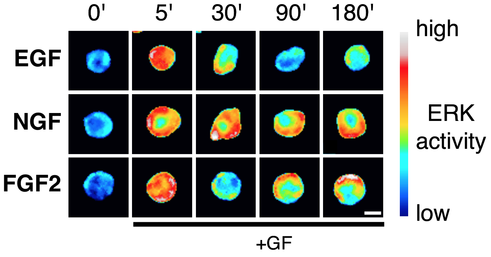
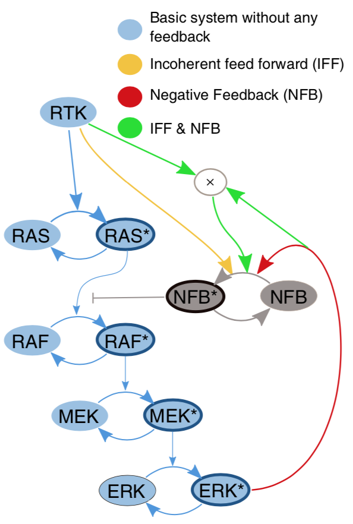
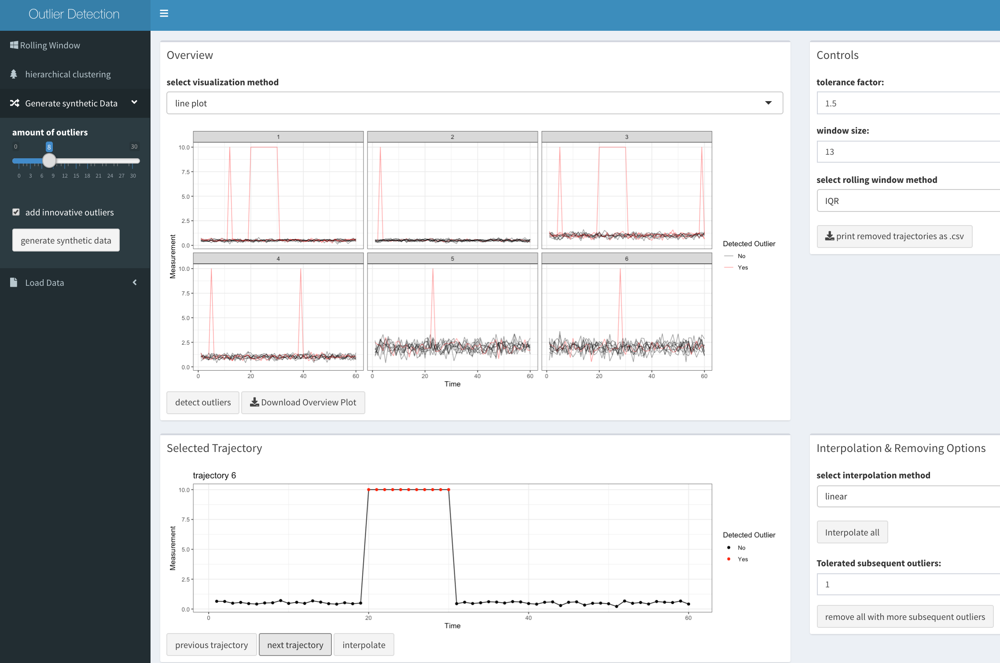

```{r setup, echo=FALSE, cache=FALSE}
library(knitr)
library(rmdformats)

## Global options
options(max.print="75")
opts_chunk$set(echo=FALSE,
	             cache=FALSE,
               prompt=FALSE,
               tidy=TRUE,
               comment=NA,
               message=FALSE,
               warning=FALSE)
opts_knit$set(width=75)
```

# Description

This R notebook accompanies the [MIC workshop](https://ilias.unibe.ch/goto_ilias3_unibe_crs_1713478.html): *Modern data analysis in R/RStudio*. It contains placeholders `(...)` to fill the code in exercises presented during the workshop.

You can *knit* this document into an HTML file. Once you fill in the code, change the parameter `eval=F` to `eval=T` in every code snippet. This way, the output of every code section will appear in the notebook.

# R primer

The *R for data Science* book and the accompanying [website](https://r4ds.had.co.nz) is an excellent resource to get acquainted with R and its applications to data science.

[Here](https://cran.r-project.org/web/packages/data.table/vignettes/datatable-intro.html) is an introduction to `data.table` package that we use extensively in this analysis. Some advanced tips and tricks with data.table are covered [here](http://brooksandrew.github.io/simpleblog/articles/advanced-data-table/).

# Data description

Data come from a microfluidic experiment where PC-12 cells were stimulated with 3 different growth factors (EGF, NGF, FGF2) at different concentrations. It comes from our recent publication *Temporal perturbation of ERK dynamics reveals network architecture of FGF2-MAPK signaling* (2019) available [here](https://doi.org/10.1101/629287).

The microfluidic device has four separate channels, thus 4 different treatments can be performed in a single experiment. 

The PC-12 cells express a FRET biosensor to indicate activity of the ERK kinase.



ERK is an end point of the MAPK signalling pathway. 



Three different growth factors tested activate different parts of the MAPK network and result in different signalling dynamics, i.e. the behaviour of ERK activity over time. 

Cells stimulated with growth factors were then imaged with a single-cell resolution over 3-4 hours at a 2-minute time resolution. Each channel of a microfluidic device was imaged at 4 different fields of view. Thus, we have 16 fields of view per experiment.

The folder `data` contains 3 sets of files that correspond to 3 growth factor treatments at 4 different concentrations. A single set from a single experiment includes:

`tCoursesSelected_xGFsust_expXXXX.csv.gz` a compressed file with single-cell data. Each row corresponds to the measurement of ERK activity in a single cell, at a single time point. Columns:

- `Metadata_Series` an integer, 0-15, that corresponds to the field of view.
- `Metadata_T` an integer, 0-100, corresponds to the time frame number in a movie from a single field of view.
- `TrackObjects_Label` an integer that describes the track number from object tracking algorithm. The number is unique only within a single field of view.
- `Intensity_MeanIntensity_Ratio` a float with the measurement of FRET ratio; this is our proxy of ERK activity.


`experimentDescription_EGFsust.xlsx` an Excel file with experiment description. Columns:

- `Position` an integer, 0-15, with the number of the field of view.
- `Channel` an integer, 1-4, with the number of the microfluidic channel.
- `Stim_Conc` a string with an indication of the GF concentration.


# Exercise 1: read data

## Read single-cell data 

Read data from a single experiment from this file `../data/original/tCoursesSelected_EGFsust_exp20170316.csv.gz`. Use `data.table::fread` function.

```{r, echo = T, eval = F}
# load required R packages
require(R.utils)
require(data.table)

# read the file
dtEGF = ...

# view first couple of lines of this dataset
head(dtEGF)
```

## Read experimental description

The experimental description is located in this Excel file `../data/original/experimentDescription_EGFsust.xlsx`.

Use `readxl::read_xlsx` function.

```{r, echo = T, eval = F}
require(readxl)

# the as.data.table function converts the tibble returned by read_xlsx function to a data table.
dtEGFexp = as.data.table(...)

head(dtEGFexp)
```

# Milestone 1

Data from all experiments merged into a single file:

```{r, echo = T, message = F}
require(R.utils)
require(data.table)

dtAll = fread("../data/m1_allGF_wExpDescr.csv.gz")

head(dtAll)
```

**Before proceeding further**, execute the cell below. It contains definitions of column names that we will use throughout this workshop.

```{r, echo = T}
# create a list with strings for column names

lCol = list(
  fov = "Metadata_Series",
  frame = "Metadata_T",
  trackid = "TrackObjects_Label",
  meas = "Intensity_MeanIntensity_Ratio",
  measNorm = "Intensity_MeanIntensity_Ratio_Norm",
  ch = "Channel",
  treatGF = "Stim_Treat",
  treatConc = "Stim_Conc",
  trackiduni = "TrackObjects_Label_Uni", # we will add this column later
  clid = "Cluster_Label"                 # we will add this column later
)
```

# Exercise 2: unique time series ID's

Create a column with unique time series ID's. It will become quite handy later on... Use `paste`, `paste0`, or `sprintf` functions to concatenate strings from different columns.

```{r, echo = T, eval = F}
dtAll[, (lCol$trackiduni) := ...]

head(dtAll)
```

# Data exploration

```{r, echo = T, eval = T}
summary(dtAll)
```

## Missing data

```{r, echo = T, eval = T}
head(dtAll[is.na(get(lCol$meas))])
```

Check measurements of a single time series

```{r, echo = T, eval = F}
dtAll[get(lCol$trackiduni) == "FGF_08_0001"][[lCol$meas]]
```


Check the length of all other time series with NA's. 

```{r, echo = T, eval = F}
# make a vector with strings of unique track ids of time series that contain NA's
vsTracksWithNAs = dtAll[is.na(get(lCol$meas))][[lCol$trackiduni]]
vsTracksWithNAs

# Key the table according to a unique track ID
setkeyv(dtAll, lCol$trackiduni)

# calculate the number of time points of tracks with NA's
head(
  dtAll[vsTracksWithNAs, .N, by = c(lCol$trackiduni)], n = 12L)
```


# Exercise 3: identify missing data

Calculate the number of time points per time series. Check the min and max. The `.N` calculates the number of rows, e.g.:

```{r, echo = T, eval = F}
summary(
  dtAll[, ..., ...][["N"]]
  )
```

Here, we chained two operations on a `data.table`. First, we calculated the number of rows per time series. This results in a new `data.table`. We then selected a single column named `N` from that table by using `[[...]]` syntax. 

Use `summary` function to calculate the 5-point statistics.

# Milestone 2

Dataset with interpolated `NA's` from **Milestone 2**:

```{r, echo = T, message = F}
require(R.utils)
require(data.table)

dtAll = fread("../data/m2_allGF_wExpDescr_noNAs.csv.gz")

head(dtAll)
```


# Plot single-cell data

```{r,echo = T, message = F, fig.align='center', fig.width= 10, fig.height=8}
require(ggplot2)
p0 = ggplot(dtAll, 
            aes_string(x = lCol$frame, y = lCol$meas, 
                       group = lCol$trackiduni)) +
  geom_path(alpha = 0.1) # parameter alpha adds transparency

p0
```


# Exercise 4A: remove point outliers

Remove single time points above the threshold **2000**, and impute them with interpolated data. Replace outlier measurements with `NA's` and interpolate them with `imputeTS::na_interpolation`.

```{r, echo = T, message = F, eval = F}
# replace time points with measurements above the threshold with NA's
dtAll[... , ...]

# interpolate NA's
require(imputeTS)
dtAll[, 
      (lCol$meas) := ..., 
      by = ...]
```


# Exercise 4B: remove dynamics outliers

Remove entire trajectories if the measurement is below **1000**. Create a vector with unique track ID's for time series that have measurements below the threshold. Subset `dtAll` using that vector and `%in` operator.

# Exercise 4B: remove dynamics outliers

```{r, echo = T, eval = F}
# vector with unique track id's of time series where measurements were below a threshold of 1000
vsTrackOut = unique(dtAll[...][[lCol$trackiduni]])

# Key the table according to a unique track ID column; allows for quick and easy subsetting
setkeyv(dtAll, lCol$trackiduni)

# leave only tracks that are NOT in the outlier vector
dtAll = dtAll[... %in% ...]

# clean
rm(vsTrackOut)
```

# Interactive removal of outliers

There's no single recipe for handling outliers; it all depends on the analysis.

A handy interactive tool written by Mauro Gwerder (a Bachelor student in Olivier Pertz lab) can help with that process. The R/Shiny app can be downloaded from [here](https://github.com/maurogwerder/Outlier_app) and executed from RStudio.




# Milestone 3

Dataset without outliers from **Milestone 3**:

```{r, echo = T}
dtAll = fread("../data/m3_allGF_wExpDescr_noNAs_noOut.csv.gz")
```


# Plot per condition

```{r, echo = T, fig.align='center', fig.width= 10, fig.height=8}
# same as above; repeated for convenience
p0 = ggplot(dtAll, aes_string(x = lCol$frame, 
                              y = lCol$meas, 
                              group = lCol$trackiduni)) +
  geom_path(alpha = 0.1) + # parameter alpha adds transparency 
  facet_grid(reformulate(lCol$treatGF, lCol$treatConc))

p0
```


# Exercise 5: normalisation

Add a column to `dtAll` with a normalised measurement where every time series is divided by the mean of its first 20 time points. Plot normalised data.

A column with the mean of first 20 elements of a group can be added this way:

```{r, echo = T, eval = F}
dt[, newCol := mean(.SD[1:20, meas]), by = uniqueID]
```

`.SD` corresponds to a subset of data as defined by `by` section. It's a temporary data table and can be used as such.


```{r, echo = T, eval = F}
# add a column with the mean of the beasline for every time series
dtAll[, 
      baseline := ..., # add a new column with the mean of first 20 rows of the group
      by = ...] # group by unique trajectory

# add a column with normalized measurement
dtAll[,
      (lCol$measNorm) := ...]

# remove baseline column
dtAll[, baseline := NULL]
```

# Milestone 4

Dataset with a column with normalised measurement.

```{r, echo = T}
dtAll = fread("../data/m4_allGF_wExpDescr_noNAs_noOut_norm0-20.csv.gz")
```

# Plot normalised data

Plot per condition using normalized data:

```{r, echo = T, fig.align='center', fig.width= 10, fig.height=8}
# same as above; repeated for convenience
p0 = ggplot(dtAll, aes_string(x = lCol$frame, 
                              y = lCol$measNorm, 
                              group = lCol$trackiduni)) +
  geom_path(alpha = 0.1) + # parameter alpha adds transparency
  facet_grid(reformulate(lCol$treatGF, lCol$treatConc))

p0
```

# Add mean to the plot

```{r, echo = T, fig.align='center', fig.width= 10, fig.height=8}
p1 = p0 +
  stat_summary(
      aes_string(y = lCol$measNorm, group = 1),
      fun.y = mean, geom = "line", group = 1,
      colour = 'red', linetype = 'solid', size = 1)

p1
```


# Beautifying plots

Add themes, e.g. `+ theme_bw()`, or themes available in packages such as `ggthemes`. 

Use `+ labels()` to add the title, subtitle, the caption.

Use `+ xlab()` or `+ ylab()` to control labels of x and y axes.

```{r, echo = T, message = F, fig.align='center', fig.width= 10, fig.height=8}
require(ggthemes)
p1 +
  theme_minimal() +
  labs(title = "ERK activity in response to sustained GF treatments",
       caption = paste0("Created on ", Sys.Date())) +
  xlab("Time (min)") +
  ylab("ERK activity")
```


# Exercise 6: interactive plots

Make an interactive plot. Use `plotly::ggplotly` function

```{r, echo = T, message = F, eval = F, fig.align='center', fig.width= 10, fig.height=8}
require(plotly)

...
```


# Exercise 7: time point snapshots

Plot ERK activity at selected time points: baseline, peak, relaxation period. Visualise as box-, dot-, violin plots, or their combination.

Use `%in` syntax to select rows, e.g.:

```{r, echo = T, eval = F}
dt[frame %in% c(10, 20, 30)]
```

Use `ggplot2` functions such as:

```{r, echo = T, eval = F}
geom_boxplot()
geom_violin()
geom_dotplot(binaxis = "y", 
             stackdir = "center", 
             position = "dodge",
             binwidth = .01, 
             binpositions = "all)
```

For simplicity's sake, we will use `aes` instead of `aes_string`. Use explicit column names: `Metadata_T`, `Intensity_MeanIntensity_Ratio_Norm`.

```{r, echo = T, eval = F, fig.align='center', fig.width= 10, fig.height=8}
ggplot(dtAll[...], 
       aes(x = ..., 
           y = ...) +
  ... +
  facet_grid(reformulate(lCol$treatGF, lCol$treatConc))
```


# Exercise 8: long to wide format

Convert `dtAll` to a matrix in a wide format using `dcast` function from the `data.table` package.

In the **long** format, every row corresponds to the measurement at a single time point.

In the **wide** format, every row corresponds to a whole single time series; column are time points.

```{r, echo = T, eval = F}
# Conversion from long to wide format
dtAllWide = data.table::dcast(dtAll, 
                  ... ~ ..., # place for the formula; LHS - row variable, RHS - column variable
                  value.var = '...') # place for the column name that will be cast into columns

# obtain row names for later
vsRowNames = dtAllWide[[lCol$trackiduni]]

# convert to a matrix; omit the first column
mAllWide = as.matrix(dtAllWide[, -1])

# assign row names to the matrix (useful for later plotting heat-maps from clustering)
rownames(mAllWide) = vsRowNames

# clean
rm(vsRowNames, dtAllWide)

# check the result
head(mAllWide)
```


# Hierarchical clustering

[Clustering](https://en.wikipedia.org/wiki/Cluster_analysis) is a data analysis technique that groups data points based on their *distance*. In the context of time series, a data point is an entire time series with all time points. 

There many methods to calculate the distance, e.g. [Euclidean](https://en.wikipedia.org/wiki/Euclidean_distance) or [Manhattan](https://en.wikipedia.org/wiki/Taxicab_geometry) distances where where time points are treated independently, or shape-based distances such as [Dynamic Time Warping](https://en.wikipedia.org/wiki/Dynamic_time_warping).

A very convenient way to visualise clustering of time series is a heatmap with a dendrogram. Use a base-R `heatmap` function to perform hierarchical clustering and to display the result as a heatmap.

```{r, echo = T, eval = F, message = F, fig.align='center', fig.width= 8, fig.height=8}
heatmap(mAllWide)
```

## Prettify the heatmap 

Things we'd like to change:

- cluster only rows,
- change the colour palette.

```{r, echo = T, eval = F, message = F, fig.align='center', fig.width= 8, fig.height=8}
require(RColorBrewer)

heatmap(mAllWide, 
        Colv = NA,
        scale = "none",
        col = rev(colorRampPalette(brewer.pal(11, "RdYlBu"))(99)),
        xlab = "Time (min)", 
        ylab = "Cells")
```

Play with parameters of `dist` and `hclust` functions. 

The former calculates the distance matrix between individual time series. Admissible parameters are: `euclidean`, `maximum`, `manhattan`, `canberra`, `binary` or `minkowski`. 

The latter performs hierarchical clustering based on the distance matrix and builds a dendrogram. Admissible parameters for dendrogram linkage in `hclust` are: `ward.D`, `ward.D2`, `single`, `complete`, `average`, `mcquitty`, `median` or `centroid`.

## Heatmaps with pheatmap

Another package to display a nicer looking heatmaps is the `pheatmap` [package](https://cran.r-project.org/web/packages/pheatmap/index.html) package.

```{r, echo = T, eval = F, message = F, fig.align='center', fig.width= 8, fig.height=8}
require(pheatmap)
require(RColorBrewer)

pheatmap::pheatmap(mAllWide, 
                   cluster_cols = F, 
                   cutree_rows = 6, 
                   treeheight_row = 100,
                   color = rev(colorRampPalette(brewer.pal(11, "RdYlBu"))(99)), 
                   clustering_distance_rows = "euclidean", 
                   clustering_method = "complete", 
                   fontsize_row = 2, 
                   fontsize_col = 5, 
                   angle_col = 45)
```


## Interactive heatmap

Create interactive heatmaps using `heatmaply` [package](https://cran.r-project.org/web/packages/heatmaply/vignettes/heatmaply.html).

```{r, echo = T, eval = F, message = F, fig.align='center', fig.width= 8, fig.height=8}
require(heatmaply)

# For the sake of performance, we only plot first 20 time series.
heatmaply(mAllWide[1:20, ], 
          Colv = NA,
          colors = rev(colorRampPalette(brewer.pal(11, "RdYlBu"))(99)),
          xlab = "Time (min)", 
          ylab = "Cells")
```


# Extract cluster information

After performing hierarchical clustering and after cutting the dendrogram at a desired level, we extract assignments of cluster numbers to individual time series. 

## Step 1: hierarchical clustering

Again, you can play with different distance and linkage methods in `dist` and `hclust` functions.

```{r, echo = T, eval = F}
clTree  <- mAllWide %>% 
  stats::dist(., method = "euclidean") %>% 
  stats::hclust(., "complete") 

str(clTree)
```


## Step 2: cut the dendrogram

Cut the dendrogram at a desired level. Here, we cut it at 6. Play with that value...

```{r, echo = T, eval = F}
clAssign = dendextend::cutree(clTree, k = 6)
head(clAssign, 20)
```

Convert named vector to a data table.

```{r, echo = T, eval = F}
dtClAssign = as.data.table(clAssign, keep.rownames = T)
setnames(dtClAssign, c(lCol$trackiduni, lCol$clid))
head(dtClAssign)
```

## Step 3: Merge 

Merge the original time series with cluster assignments for individual time series.

```{r, echo = T, eval = F}
dtAllCl = merge(dtAll, 
                dtClAssign, 
                by = lCol$trackiduni)

# convert the cluster label to a factor
dtAllCl[, (lCol$clid) := as.factor(get(lCol$clid))]

head(dtAllCl)
```

# Milestone 5

If your are completely lost, here's a file with the dataset resulting from previous steps:

```{r, echo = T}
dtAllCl = fread("../data/m5_allGF_wExpDescr_noNAs_noOut_norm0-20_cl.csv.gz")

# convert cluster label to a factor
dtAllCl[, (lCol$clid) := as.factor(get(lCol$clid))]
```

# Exercise 9: plot time series per cluster

Plot time series in each cluster, include the population mean. Use faceting per cluster.


```{r, echo = T, eval = F, fig.align='center', fig.width= 10, fig.height=5}
ggplot(dtAllCl, 
       aes_string(x = lCol$frame, 
                  y = lCol$measNorm, 
                  group = lCol$trackiduni)) +
  geom_path(alpha = 0.1) +
  stat_summary(
      aes_string(y = lCol$measNorm, group = 1),
      fun.y = ..., # place for a function to calculate the summary
      geom = "line", group = 1,
      colour = 'red', linetype = 'solid', size = 1) +
  facet_wrap(...) + # place for a faceting variable
  theme_minimal() +
  labs(title = "Clusters of ERK activity dynamic responses",
       caption = paste0("Created on ", Sys.Date())) +
  xlab("Time (min)") +
  ylab("ERK activity (normalised)")
```


# Exercise 10: contribution of clusters per condition 

Calculate and plot the composition of experimental conditions with respect to clusters. Perform data aggregation to calculate the number of time series per group, per cluster. The short-cut to calculate the number of rows in `data.table` is `.N`, e.g.

```{r, echo = T, eval = F}
dt[, .(nTimeSer = .N), by = group]
```


Aggregate and assign the result to a new data table `dtAllClN`:

```{r, echo = T, eval = F}
dtAllClN = dtAllCl[, 
                   ..., 
                   by = c(...)]

head(dtAllClN)
```


Make a bar-plot:

```{r, echo = T, eval = F, message = F, fig.align='center', fig.width= 10, fig.height=7}
# for percentages on y-axis in ggplot
require(scales)

# The core plot: concentrations on the x-axis, the number of time series on y-axis
p5 = ggplot(dtAllClN, aes_string(x = ..., # places for x and y variables
                                 y = ...))

# Facetting per growth factor
p5 = p5 +
  facet_wrap(...)
  
# Stacked bar plot with bars coloured by cluster number
# Bars are stretched to "fill" the y-axis using the option position = position_fill()
p5 = p5 +
  geom_bar(aes_string(...), # place for variable to colour the bars
           stat = "identity", 
           position = position_fill())

# Convert y-axis labels to percentages (0-100%) instead of (0-1)
p5 = p5 +
  scale_y_continuous(labels = percent)

# Use a nice colour palette for colour fill
p5 = p5 +
  scale_fill_manual("GF:", 
                    values = ggthemes::tableau_color_pal("Color Blind")(6))
  
# Prettify the plot; add labels, etc
p5 = p5 +
  theme_minimal() +
  labs(title = "Participation of clusters in experimental conditions",
       caption = paste0("Created on ", Sys.Date())) +
  xlab("") + 
  ylab("Percentage") +
  theme(axis.text.x =  element_text(angle = 45, hjust = 1))

p5
```


# Clustering validation

Based on [Clustering Validation Statistics](http://www.sthda.com/english/wiki/print.php?id=241).

To work on this section, you need to load the data from **Milestone 4** and to convert it to wide format. 

```{r, echo = T, echo = F}
# Here's the relevant snippet for convenience; don't show it in the knitted document
dtAll = fread("../data/m4_allGF_wExpDescr_noNAs_noOut_norm0-20.csv.gz")

# convert to wide format
dtAllWide = dcast(dtAll, 
                  reformulate(response = lCol$trackiduni, termlabels = lCol$frame), 
                  value.var = lCol$measNorm) 

vsRowNames = dtAllWide[[lCol$trackiduni]]
mAllWide = as.matrix(dtAllWide[, -1])
rownames(mAllWide) = vsRowNames

rm(vsRowNames, dtAllWide)
```


## Optimal number of clusters - Silhouette method

```{r, echo = T, message = F, fig.align='center'}
require(factoextra)

# Silhouette method
factoextra::fviz_nbclust(mAllWide, hcut, method = "silhouette") +
  labs(subtitle = "Silhouette method")

```


## Optimal number of clusters - Gap statistics method

```{r, echo = T, fig.align='center', cache.lazy=T}
# Gap statistic
# nboot = 10 to keep the function speedy. 
# recommended value: nboot= 500 for your analysis.
# Use verbose = FALSE to hide computing progression.
set.seed(123)
factoextra::fviz_nbclust(mAllWide, hcut, method = "gap_stat",
                         nstart = 25, nboot = 10)+
  labs(subtitle = "Gap statistic method")
```

## 30 indices

We’ll use the package `NbClust` which will compute, with a single function call, 30 indices for deciding the right number of clusters in the dataset:

```{r, echo = T, message = F, cache.lazy=T}
require(NbClust)
nb <- NbClust(mAllWide, 
              distance = "euclidean", 
              min.nc = 2, max.nc = 10, 
              method = "complete", 
              index ="all")
```

Visualise results from `NbClust`:

```{r, echo = T, fig.align='center'}
# Visualize the result
factoextra::fviz_nbclust(nb) + theme_minimal()
```

## Visualise clusters

```{r, echo = T, fig.align='center'}
hc.res <- factoextra::eclust(mAllWide, 
                             "hclust", k = 3, graph = FALSE,
                             hc_method = "complete", 
                             hc_metric = "euclidean")

# Visualize clusters
factoextra::fviz_cluster(hc.res, geom = "point", frame.type = "norm")

```

## Visualise silhouette

```{r, echo = T, fig.align='center'}
factoextra::fviz_silhouette(hc.res)
```


# Interactive clustering

A free R/Shiny app developed in Olivier Pertz lab available from [here](https://github.com/dmattek/shiny-timecourse-inspector).

